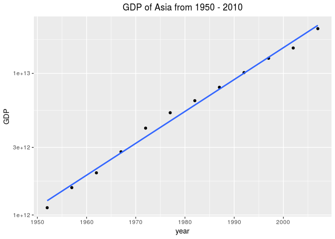
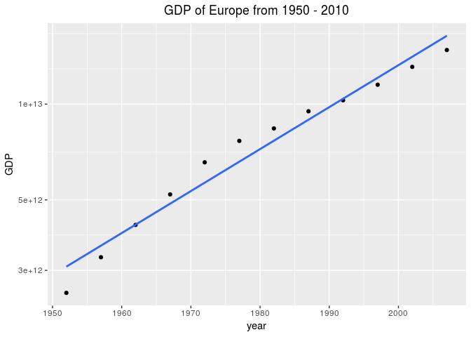

Homework 4
================

``` r
suppressPackageStartupMessages(library(tidyverse))
```

    ## Warning: replacing previous import by 'tibble::as_tibble' when loading
    ## 'broom'

    ## Warning: replacing previous import by 'tibble::tibble' when loading 'broom'

``` r
suppressPackageStartupMessages(library(gapminder))
```

Data Reshaping
--------------

First, we reshape the data:

``` r
gdpTable <- gapminder %>% 
  mutate(gdp = gdpPercap*pop) %>% 
  group_by(continent, year) %>%
  summarize(totalGDP = sum(gdp)) %>% 
  spread(key = continent, value = totalGDP)

gdpTableDisp <- gdpTable %>% 
  mutate(Africa = sprintf("%0.2e", Africa)) %>% 
  mutate(Asia = sprintf("%0.2e", Asia)) %>% 
  mutate(Americas = sprintf("%0.2e", Americas)) %>% 
  mutate(Europe = sprintf("%0.2e", Europe)) %>% 
  mutate(Oceania = sprintf("%0.2e", Oceania))

knitr::kable(gdpTableDisp)
```

|    year| Africa     | Americas    | Asia       | Europe      | Oceania                          |
|-------:|:-----------|:------------|:-----------|:------------|:---------------------------------|
|    1952| 3.12e+11   | 2.94e+12    | 1.13e+12   | 2.55e+12    | 1.08e+11                         |
|    1957| 3.83e+11   | 3.52e+12    | 1.56e+12   | 3.30e+12    | 1.34e+11                         |
|    1962| 4.57e+11   | 4.23e+12    | 1.98e+12   | 4.17e+12    | 1.65e+11                         |
|    1967| 5.95e+11   | 5.45e+12    | 2.79e+12   | 5.20e+12    | 2.12e+11                         |
|    1972| 7.84e+11   | 6.70e+12    | 4.10e+12   | 6.56e+12    | 2.68e+11                         |
|    1977| 9.72e+11   | 8.10e+12    | 5.27e+12   | 7.66e+12    | 3.09e+11                         |
|    1982| 1.15e+12   | 9.08e+12    | 6.42e+12   | 8.38e+12    | 3.52e+11                         |
|    1987| 1.25e+12   | 1.10e+13    | 7.98e+12   | 9.50e+12    | 4.19e+11                         |
|    1992| 1.37e+12   | 1.22e+13    | 1.01e+13   | 1.03e+13    | 4.73e+11                         |
|    1997| 1.56e+12   | 1.46e+13    | 1.28e+13   | 1.15e+13    | 5.79e+11                         |
|    2002| 1.84e+12   | 1.65e+13    | 1.51e+13   | 1.31e+13    | 6.90e+11                         |
|    2007| 2.38e+12   | 1.94e+13    | 2.07e+13   | 1.48e+13    | 8.07e+11                         |
|  We can| now take a | look at the | GDP of Asi | a (or any o | ther continent, for that matter) |

``` r
gdpTable %>% 
  ggplot(aes(x=year, y=Asia)) + 
  geom_point() + 
  scale_y_log10() + 
  geom_smooth(method='lm', se = FALSE) + 
  ylab('GDP') + 
  ggtitle(paste0('GDP of Asia from 1950 - 2010')) +
  theme(plot.title = element_text(hjust = 0.5))
```



``` r
gdpTable %>% 
  ggplot(aes(x=year, y=Europe)) + 
  geom_point() + 
  scale_y_log10() + 
  geom_smooth(method='lm', se = FALSE) + 
  ylab('GDP') + 
  ggtitle(paste0('GDP of Europe from 1950 - 2010')) +
  theme(plot.title = element_text(hjust = 0.5))
```



Join
----

``` r
filtered <- gapminder %>% 
  filter(year == 2007)
```

Create a new data frame corresponding to countries and their land area:

``` r
newdf <- tribble(
  ~country, ~area, 
  'Afghanistan', 652860, 
  'Austria', 82523, 
  'Bangladesh', 130170,
  'China', 9388211, 
  'Germany', 348900,
  'Spain', 500210,
  'United Kingdom', 241930, 
  'Croatia', 55960,
  'Cambodia', 176520,
  'Mexico', 1943950, 
  'Serbia', 87460, 
  'Canada', 9093510,
  'Pakistan', 770880,
  'Singapore', 709, 
  'Australia', 7682300,
  'Egypt', 995450,
  'Brazil', 8358140
)
```

Now, we can join the tables and compute the population density for certain countries

``` r
df <- inner_join(filtered, newdf, by = 'country') # joins both created tables by country
```

    ## Warning: Column `country` joining factor and character vector, coercing
    ## into character vector

``` r
df = mutate(df, popDensity = pop/area)
df = select(df, country, continent, popDensity)
knitr::kable(df)
```

| country        | continent |   popDensity|
|:---------------|:----------|------------:|
| Afghanistan    | Asia      |    48.846495|
| Australia      | Oceania   |     2.659903|
| Austria        | Europe    |    99.363608|
| Bangladesh     | Asia      |  1155.783506|
| Brazil         | Americas  |    22.733604|
| Cambodia       | Asia      |    80.058112|
| Canada         | Americas  |     3.671865|
| China          | Asia      |   140.461595|
| Croatia        | Europe    |    80.295068|
| Egypt          | Africa    |    80.631416|
| Germany        | Europe    |   236.173677|
| Mexico         | Americas  |    55.917534|
| Pakistan       | Asia      |   219.581020|
| Serbia         | Europe    |   116.056083|
| Singapore      | Asia      |  6421.733427|
| Spain          | Europe    |    80.862420|
| United Kingdom | Europe    |   251.214145|
